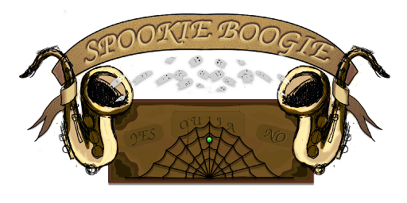

Source code for the Jumble Devs Spookie Boogie game.
Developed for the 2016 Global Game Jam at Gandia.

Spookie Boogie is a game in which you help the ghost 
of Sir Clockengurch, who was a saxofon player, to kick some teens out of 
his manor when they summon him from hell using a Ouija board. 

If you manage to scare the teens out of Sir Clockengurch home, you win.
Tap the furniture to interact with it and scare the teens, but take care,
they arent all scared equally by every object in game. Fill the Spook-O-Meter 
to win in classic mode, or play endless mode in Time Attack, where 
successful spooks give you more time and more points! Share your score 
by typing your name in the settings tab and playing Time attack to enter 
the Leaderboard.

# Credits

Spookie Boogie was developed by the following people, in alphabetical order:

* Aitor Cortés Sáez (@Aitor1405), programming, art.
* Irene Gil Giménez, art, level design.
* César González Segura (@cegonse), programming.
* Jose A. Hernández Ruíz, art, level design.
* Fco. Javier Moragón Fernández (@jamofer), programming.
* Adrian Peláez Serrano (@Adpese), programming, art.
* Ximo Ventimilla Zuñiga, art, level design.

Special thanks to Pablo Boscà Martínez for the game music and several SFX's.

# Building

The game was developed using the Unity3D game engine version 5.3.2. It should compile
and work right away for the Windows, Linux, Mac OS X, Android and Windows Phone platforms.

The server side code is developed in Node.JS and runs on version 4.3.1. It needs the
SQLite 3 module which can be obtained from npm.

# Assets

To build the game you will need its assets, which you can download from this external link:
--COMING SOON--

# License

As with all Global Game Jam games, Spookie Boogie is licensed under the Creative Commons Attribution-
NonCommercial-ShareAlike 3.0 license.

Feel free to use the code and assets included in this project, as long as you give us credit. Do not
use these assets for any kind of commercial purpose. If you use any of these assets, you must keep
this same license on your derivatives.
